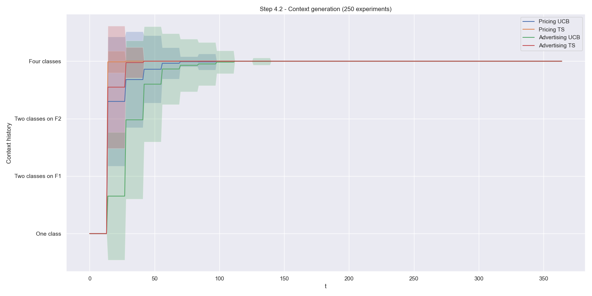

# OLA - Pricing & Advertising

## Description
In this project we developed a marketing strategy for the e-commerce website of an airline company, based on Multi-Armed Bandits (MABs) algorithms.

Two possible optimizations are possible:
- **Pricing strategy:** the company wants to learn the best price to sell its tickets, maximizing the product of the price of the ticket and of the corresponding conversion rate
- **Advertising strategy:** the company wants to develop an advertising campaign so that a publisher will display some advertisements to potential customers. The company wants to learn the optimal bid to use, which is the maximum amount it is willing to pay the publisher for each click 

## Setup
The project was developed and tested using Python 3.11.

Clone the repository and install all the required packages with:

    pip install -r requirements.txt

## Environment
The environment we used for the simulations is composed by 3 **classes** of users:
- Under 25
- Adults with age in the range of 25-40 years
- Over 40

The users are distinguished by two **features**:
- Whether they choose to buy a checked luggage
- Whether they buy a first-class ticket

The flight market is affected by **seasonality** which subsequently influences the conversion rates:
- The winter period, in which the conversion rates are medium
- The spring period, characterized by lower conversion rates
- The summer period, which features very high conversion rates

## Algorithms
The following are the algorithms that we implemented to learn the **optimal** **solution** of the environment in the various simulations:
- UCB1
- Thompson Sampling
- Gaussian Process UCB (GP-UCB)
- Gaussian Process TS (GP-TS)
- Sliding Window UCB1 (SW-UCB1)
- Change Detection UCB1 (CD-UCB1)
- EXP3

## Simulations
The following are the different **scenarios** of the **environment** in which we run the simulations:
1. Learning for **pricing**: pricing strategy is learnt, advertising strategy is known
2. Learning for **advertising**: advertising strategy is learnt, pricing strategy is known
3. Learning for **joint** pricing and advertising: both strategies need to be learnt
4. Contexts and their **generation**: a context generation algorithm is run in order to determine how many contexts are there in the environments and when it is feasible to switch from an aggregated learner to dedicated per-class learners
5. Dealing with non-stationary environments with **two abrupt changes**: pricing strategy needs to be learnt in an environment in which the optimal solution changes over time
6. Dealing with non-stationary environments with **many abrupt changes**: like step 5 but with more phases and a very high change frequency

## Results
Here we present some of the results of our simulations. For a complete overview of the results, refer to the [presentation](presentation/complete%20presentation.pdf) and to all the [plots](plots) that we generated.

The **instantaneous regret** of GP-UCB and GP-TS in step 2, which eventually converges to the optimal solution:

The results of the context generation algorithm in step 4, which achieves a **logarithmic cumulative regret** and a performance very close to the scenario in which the contexts are known beforehand:

The evolution of the **choice of the context** of the context generation algorithm during the simulation:

The **instantaneous reward** of EXP3 and of the other algorithms in step 6:

## Software
- [NumPy](https://numpy.org/)
- [Scikit-learn](https://scikit-learn.org/stable/index.html)
- [Matplotlib](https://matplotlib.org)
- [Seaborn](https://seaborn.pydata.org)
- [Python](https://www.python.org/)
- [PyCharm](https://www.jetbrains.com/pycharm/)

## License
Licensed under [MIT License](LICENSE)   